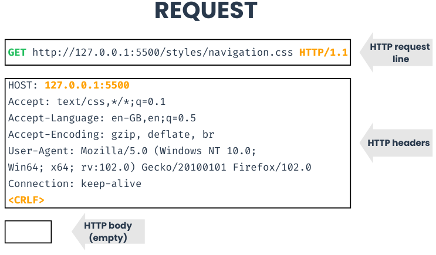
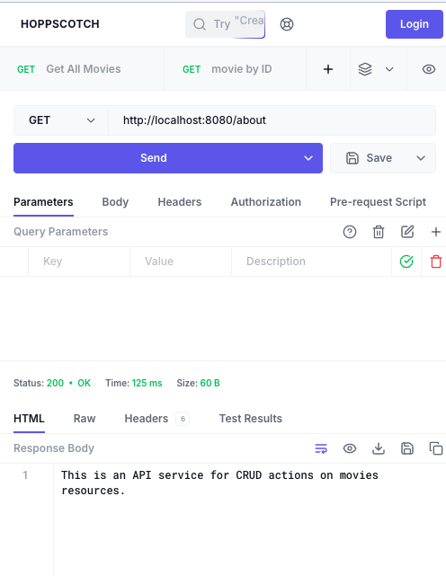

# ExpressJS

This content will explore [ExpressJS](https://expressjs.com/en/starter/installing.html) (sometimes just known as *Express*), a Node-based web framework that allows us to create server logic. 

We will use the Express web framework to build our RESTful API for an application that let's you view a list of movies from a server. Express will let us create our application logic to handle what our application should do depending on what HTTP requests are made to which endpoints.

For example, to handle a request for a `GET` request to the root `/` path of a server instance that responds with a JSON message, you could write the following code:

```js
// import express module
const express = require("express");

const PORT = 9000;

// declare variable as an instance of an express server
const app = express()

app.get("/", (req, res) => {res.json({message: "abc"})});

app.listen(PORT, () => {
  console.log(`Server is running on port ${PORT}.`);
});
```

An HTTP request will be sent out to an API whenever a user interacts with it. A request will often have data associated with it attached in the form of a *request body* and *request header*. The *request line* includes where the request is being sent to as well as which HTTP verb.

 

We'll be using the Hoppscotch web client to make requests to the server's API for debugging and testing purposes.


## Running An Express App

Open your terminal and change directories to [starter-movies-api](../reference/starter-movies-api/). We will be looking at the [index.js](../reference/starter-movies-api/index.js) file for the introduction to Express. All the code in first step is already implemented in the starter app code. This step is to understand a bit more about Express and the starter code provided.

First we initialize an `express` object. This gives us an entrypoint into Express's functionality.

```javascript
const express = require("express");
```

We create an app (called `app`) that uses `express` with the default parameters.

```javascript
const app = express();
```

Now we specify a variable for the port number our application will run on when we start it.

```js
const PORT = 8080;
```

We then create a *route* for the path (`/about`) for the `GET` HTTP method.

When someone sends a `GET` request to the *about* path (`GET /about`) then we return a string detailing our API.

```javascript
// about our API
app.get("/about", (req, res) => {
	res.send("This is an API service for CRUD actions on movies resources.");
});
```

Finally, the code to run the server.

```javascript
app.listen(PORT, () => {
  console.log(`Server is running on port ${PORT}.`);
});
```

## Breaking Down This Express Syntax

Let's take a deeper dive into the Express syntax...

```js
// about our API
app.get("/about", (req, res) => {
	res.send("This is an API service for CRUD actions on movies resources.");
});
```

`app` is an Express application that is an object. To learn more about this Express application object, check out the [full documentation](https://expressjs.com/en/4x/api.html). This Express application object contains a method called `get()` which is used to create a get request listener for our application.

The [`app.get(path, callback)`](https://expressjs.com/en/4x/api.html#app.get.method) method takes 2 parameters - The first is a string which represents the path, and the second is a callback function which will be invoked when the path and HTTP method is matched.

<details>
<summary>What is an HTTP method?</summary>
<br>

> An HTTP method is a way to annotate to an API what the intended action is for a given endpoint. Here are some common endpoints and their paired intended action:
>
> - GET - Get data
> - POST - Create data
> - PUT - Update data
> - DELETE - Delete data
>
</details>
<br>

The callback function takes two parameters - an [Express Request](https://expressjs.com/en/4x/api.html#req), and [Express Response](https://expressjs.com/en/4x/api.html#res). The request contains information about the request coming from the client such as path parameters, query parameters, headers, body (if the request is the appropriate HTTP verb to have a body), and more. The response is the object we will use to respond back to the client, often with the [`send()`](https://expressjs.com/en/4x/api.html#res.send), or [`json()`](https://expressjs.com/en/4x/api.html#res.json) methods.

Here is an example of defining a function to use as a callback instead of writing the code inline could look:

```js
// A Sample callback function

function handleAboutPath(req, res) {
  // ignoring the req variable here for a simple example
	res.send("This is an API service for CRUD actions on movies resources.");
}

// Integrate the callback function into the GET / request

app.get("/about", handleAboutPath)
```

The code block above where the callback function is broken out into its own `handleAboutPath` function has the same functionality as the initial code shown in this section where an anonymous arrow function was used to define the callback function.

## Continue Making The Express API

Upon cloning the repo, one route (`/about`) will already be in place for our Express application's API.

To start the server:

- Ensure your terminal is in the [starter-movies-api](../reference/starter-movies-api/) which contains your `package.json` file.
- Run `npm install` to install the application dependencies.
- Run `npm run start:dev` to start the server.

To actually access our current endpoint, we can use Hoppscotch! Enter `http://localhost:8080/about` to send a `GET` request to the root endpoint `/about`. Press **Send**.

Your response should look like:

 

Now we will create another *route* endpoint that uses parameters to take in dynamic values from the URL provided whenever it is called. For a path with a parameter `name`, when someone calls `GET about/{name}` we are going to return an "about" string value that uses the `name` variable. So if a client sends a `GET /about/sample-name` request, the API would respond with `"This is an API service for CRUD actions on a movies resource...for you, sample-name"`

***index.js***

```javascript
// the {name} value is dynamic based on the URL provided.
app.get("/about/:name", (req, res) => {
	const name = req.params.name;
	res.send(
		"This is an API service for CRUD actions on a movies resource...for you, " +
			name
	);
});
```

<details>
<summary>Our API code at this point in the code along</summary>
<br>

***index.js***


```js
const express = require("express");
const app = express();
const PORT = 8080;

// about our API
app.get("/about", (req, res) => {
	res.send("This is an API service for CRUD actions on movies resources.");
});

// the {name} value is dynamic based on the URL provided.
app.get("/about/:name", (req, res) => {
	const name = req.params.name;
	res.send("This is an API service for CRUD actions on a movies resource...for you " + name);
});

app.listen(PORT, () => {
	console.log(`Server is running on port ${PORT}.`);
});

```

</details>
<br>
 
Next Section --> [3-Creating-Movie-Api](./../3-creating-movie-api/README.md)
