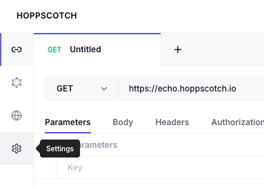
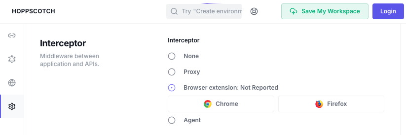

# Getting Set Up

## Cloning This Repo

We will use `git` to download the repository to our local machine.

| Command           | Description                                                                                                    |
| ----------------- | -------------------------------------------------------------------------------------------------------------- |
| `git clone {url}` | Clone (download) a repository to your local machine.                                                           |
| `git pull`        | Download any changes made to the repository since you downloaded it. You must `cd` into the repository folder. |

So for example, to download this repository, we would run

```sh
git clone https://github.com/Black-and-Hispanic-Tech-Summit/APIs-101.git
cd APIs-101
```

## Hoppscotch

We will use [Hoppscotch.io](https://hoppscotch.io/) to test API responses. Hoppscotch is a web-based API development tool, available directly in the browser.

1. Go to [hoppscotch.io](https://hoppscotch.io/).
1. If this is your first time using the tool, click the Settings icon on the left.
    
    
1. In Settings, scroll to the Interceptor section. Select **Browser extension: Not Reported**

    
1. Click the browser of your choice.
    And follow instructions in the tab that opens for either Chrome or Firefox.
1. Return to hoppscotch.io and refresh the page.

That's it! You can start at [the apis section](./1-apis/README.md) to follow along. Hoppscotch will be ready for you to use throughout the exercise.
